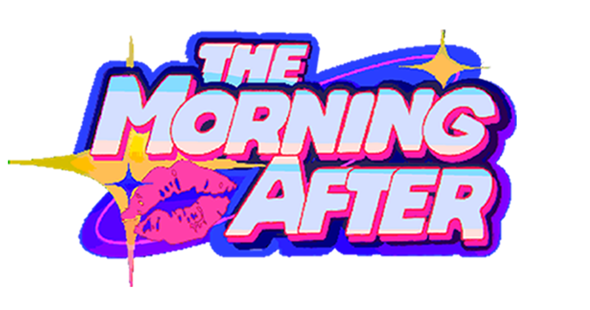

<link rel="stylesheet" href="{{ site.baseurl }}/assets/css/main.css">

  

    <!--<h1>The Morning After</h1>-->
        

            
        

    <h2>A makeout mystery you'll be thirsting to solve!</h2>
    <a class="btn" href="#trailer">Watch Trailer</a>
  

<section class="section">

  

    
    

      <h2>Reality Deformation</h2>
      
Environments shift as memory collapses. No two paths are identical.

    

  

  

    
    

      <h2>Fragmented Exploration</h2>
      
Navigate layered spaces built from corrupted recollections.

    

  

  

    
    

      <h2>Signal-Based Storytelling</h2>
      
Discover narrative through visual echoes and environmental traces.

    

  

</section>

<section class="full-banner" style="background-image: url('assets/img/bg.png');">
  

    <h2>Every frame hides a clue.</h2>
  

</section>

<section class="section" id="trailer">

  <h2>Gameplay</h2>

  

    <iframe 
      src="https://www.youtube.com/embed/VIDEO_ID"
      frameborder="0"
      allowfullscreen>
    </iframe>
  

</section>

<section class="cta">
  <h2>Enter the Depths</h2>
  <a class="btn" href="#">Download Demo</a>
</section>

